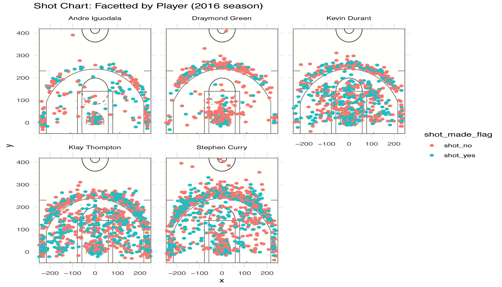

```{r setup, include=FALSE}
knitr::opts_chunk$set(echo = TRUE)
```

##**Raw Code Script**
```{r}
library(dplyr)
#creating 2PT Effective Shooting % by Player table
bind_dataframe <- read.csv("~/workout01/data/shots-data.csv", header = TRUE, stringsAsFactors = FALSE, row.names = 1)
twopoint_perc_chart <- arrange(summarise(group_by(bind_dataframe, name), 
                                     total = sum(shot_type == "2PT Field Goal"),
                                 made = sum(shot_made_flag == "shot_yes" & shot_type == "2PT Field Goal"), perc_made = made/total), desc(perc_made))
twopoint_perc_chart
threepoint_perc_chart <- arrange(summarise(group_by(bind_dataframe, name),
                                   total = sum(shot_type == "3PT Field Goal"),
                                   made = sum(shot_made_flag == "shot_yes" & shot_type == "3PT Field Goal"), 
                                   perc_made = made/total), desc(perc_made))
threepoint_perc_chart
overall_perc_chart <- arrange(summarise(group_by(bind_dataframe, name),
                                   total = sum(shot_type == "2PT Field Goal" | shot_type == "3PT Field Goal"),
                                   made = sum(shot_made_flag == "shot_yes"), 
                                   perc_made = made/total), desc(perc_made))
overall_perc_chart
```

--------------------------------------------

##**The Golden State Warriors Have Golden Shooters**

The Golden State Warriors (GSW) had an outstanding season in 2016 with statistics that show the high performance of their top players. Though merely joining the team in 2016, Kevin Durant has already proved himself to be a star.

I examined some statistics regarding the effective shooting percentages of Stephen Curry, Kevin Durant, Draymond Green, Andre Iguodala, and Klay Thompson in the 2016 NBA season. I first gathered each of their two-point field goal effective shooting percentage, which is in the below table. Clearly, Durant had an effective shooting percentage of 60% for two-point field goals, placing him in the top 10 players with the highest two-point field goal effective shooting percentages in the 2016-2017 NBA season. [1](https://www.teamrankings.com/nba/player-stat/field-goal-percentage?season_id=214)

```{r}
as.data.frame(twopoint_perc_chart)
```

As for three-point field goals, I've accumulated the following table. Klay Thompson and Stephen Curry have placed themselves in the top 20 players (in a list of 100+) with the highest three-point efficiency percentages in the 2016-2017 NBA season. [1](https://www.teamrankings.com/nba/player-stat/field-goal-percentage?season_id=214)

```{r}
as.data.frame(threepoint_perc_chart)
```

Broadly speaking, these five players all had an overall effective shooting percentage of over 40%, which does not seem overwhelmingly impressive but the team did earn around an 82% winning record in that season. [2](https://www.teamrankings.com/nba/team/golden-state-warriors/win-trends)

```{r}
as.data.frame(overall_perc_chart)
```

For a more visual representation of each of their performances in shooting, here I have 5 facetted graphs of their attempts to shoot from different spots on the court. In hindsight, 2016-2017 may not have been the best season that GSW has ever had, but its players' statistics still never cease to impress anyone, especially when singled out from the entire Association. 

```{r out.width= '80%', echo = FALSE, fig.align='center'}
library(knitr)

```