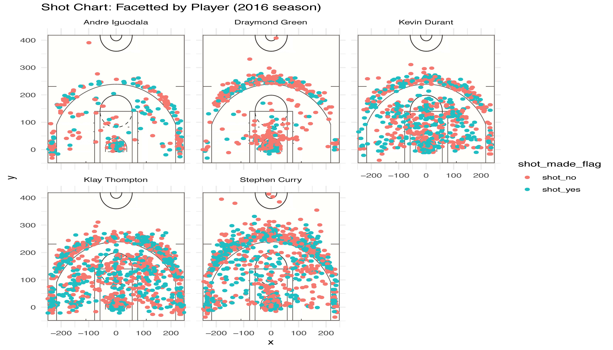

Workout 1 Report
================
Ana Fung
3/10/2019

**Raw Code Script**
-------------------

``` r
library(dplyr)
```

    ## 
    ## Attaching package: 'dplyr'

    ## The following objects are masked from 'package:stats':
    ## 
    ##     filter, lag

    ## The following objects are masked from 'package:base':
    ## 
    ##     intersect, setdiff, setequal, union

``` r
#creating 2PT Effective Shooting % by Player table
bind_dataframe <- read.csv("~/workout01/data/shots-data.csv", header = TRUE, stringsAsFactors = FALSE, row.names = 1)
twopoint_perc_chart <- arrange(summarise(group_by(bind_dataframe, name), 
                                     total = sum(shot_type == "2PT Field Goal"),
                                 made = sum(shot_made_flag == "shot_yes" & shot_type == "2PT Field Goal"), perc_made = made/total), desc(perc_made))
```

    ## Warning: `as_dictionary()` is soft-deprecated as of rlang 0.3.0.
    ## Please use `as_data_pronoun()` instead
    ## This warning is displayed once per session.

    ## Warning: `new_overscope()` is soft-deprecated as of rlang 0.2.0.
    ## Please use `new_data_mask()` instead
    ## This warning is displayed once per session.

    ## Warning: The `parent` argument of `new_data_mask()` is deprecated.
    ## The parent of the data mask is determined from either:
    ## 
    ##   * The `env` argument of `eval_tidy()`
    ##   * Quosure environments when applicable
    ## This warning is displayed once per session.

    ## Warning: `overscope_clean()` is soft-deprecated as of rlang 0.2.0.
    ## This warning is displayed once per session.

``` r
twopoint_perc_chart
```

    ## # A tibble: 5 x 4
    ##             name total  made perc_made
    ##            <chr> <int> <int>     <dbl>
    ## 1 Andre Iguodala   210   134 0.6380952
    ## 2   Kevin Durant   643   390 0.6065319
    ## 3  Stephen Curry   563   304 0.5399645
    ## 4  Klay Thompton   640   329 0.5140625
    ## 5 Draymond Green   346   171 0.4942197

``` r
threepoint_perc_chart <- arrange(summarise(group_by(bind_dataframe, name),
                                   total = sum(shot_type == "3PT Field Goal"),
                                   made = sum(shot_made_flag == "shot_yes" & shot_type == "3PT Field Goal"), 
                                   perc_made = made/total), desc(perc_made))
threepoint_perc_chart
```

    ## # A tibble: 5 x 4
    ##             name total  made perc_made
    ##            <chr> <int> <int>     <dbl>
    ## 1  Klay Thompton   580   246 0.4241379
    ## 2  Stephen Curry   687   280 0.4075691
    ## 3   Kevin Durant   272   105 0.3860294
    ## 4 Andre Iguodala   161    58 0.3602484
    ## 5 Draymond Green   232    74 0.3189655

``` r
overall_perc_chart <- arrange(summarise(group_by(bind_dataframe, name),
                                   total = sum(shot_type == "2PT Field Goal" | shot_type == "3PT Field Goal"),
                                   made = sum(shot_made_flag == "shot_yes"), 
                                   perc_made = made/total), desc(perc_made))
overall_perc_chart
```

    ## # A tibble: 5 x 4
    ##             name total  made perc_made
    ##            <chr> <int> <int>     <dbl>
    ## 1   Kevin Durant   915   495 0.5409836
    ## 2 Andre Iguodala   371   192 0.5175202
    ## 3  Klay Thompton  1220   575 0.4713115
    ## 4  Stephen Curry  1250   584 0.4672000
    ## 5 Draymond Green   578   245 0.4238754

------------------------------------------------------------------------

**The Golden State Warriors Have Golden Shooters**
--------------------------------------------------

The Golden State Warriors (GSW) had an outstanding season in 2016 with statistics that show the high performance of their top players. Though merely joining the team in 2016, Kevin Durant has already proved himself to be a star.

I examined some statistics regarding the effective shooting percentages of Stephen Curry, Kevin Durant, Draymond Green, Andre Iguodala, and Klay Thompson in the 2016 NBA season. I first gathered each of their two-point field goal effective shooting percentage, which is in the below table. Clearly, Durant had an effective shooting percentage of 60% for two-point field goals, placing him in the top 10 players with the highest two-point field goal effective shooting percentages in the 2016-2017 NBA season. [1](https://www.teamrankings.com/nba/player-stat/field-goal-percentage?season_id=214)

``` r
as.data.frame(twopoint_perc_chart)
```

    ##             name total made perc_made
    ## 1 Andre Iguodala   210  134 0.6380952
    ## 2   Kevin Durant   643  390 0.6065319
    ## 3  Stephen Curry   563  304 0.5399645
    ## 4  Klay Thompton   640  329 0.5140625
    ## 5 Draymond Green   346  171 0.4942197

As for three-point field goals, I've accumulated the following table. Klay Thompson and Stephen Curry have placed themselves in the top 20 players (in a list of 100+) with the highest three-point efficiency percentages in the 2016-2017 NBA season. [1](https://www.teamrankings.com/nba/player-stat/field-goal-percentage?season_id=214)

``` r
as.data.frame(threepoint_perc_chart)
```

    ##             name total made perc_made
    ## 1  Klay Thompton   580  246 0.4241379
    ## 2  Stephen Curry   687  280 0.4075691
    ## 3   Kevin Durant   272  105 0.3860294
    ## 4 Andre Iguodala   161   58 0.3602484
    ## 5 Draymond Green   232   74 0.3189655

Broadly speaking, these five players all had an overall effective shooting percentage of over 40%, which does not seem overwhelmingly impressive but the team did earn around an 82% winning record in that season. [2](https://www.teamrankings.com/nba/team/golden-state-warriors/win-trends)

``` r
as.data.frame(overall_perc_chart)
```

    ##             name total made perc_made
    ## 1   Kevin Durant   915  495 0.5409836
    ## 2 Andre Iguodala   371  192 0.5175202
    ## 3  Klay Thompton  1220  575 0.4713115
    ## 4  Stephen Curry  1250  584 0.4672000
    ## 5 Draymond Green   578  245 0.4238754

For a more visual representation of each of their performances in shooting, here I have 5 facetted graphs of their attempts to shoot from different spots on the court. In hindsight, 2016-2017 may not have been the best season that GSW has ever had, but its players' statistics still never cease to impress anyone, especially when singled out from the entire Association.


